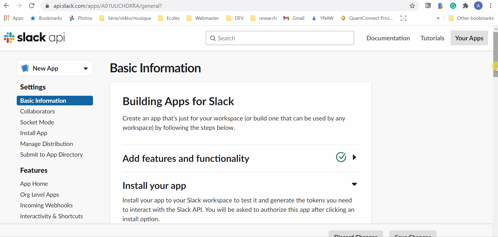

# Your first Steps creating a Slack Application in Golang

<p>
<span>Published version:</span>
<a href="https://medium.com/geekculture/build-slack-application-in-golang-using-socket-mode-setting-up-57f454e63c0a?sk=03196a8c492a76cd7ef9a73628fe4524"></a>
</p>


## Tutorial Step 1: Configure your Application

Create a [new Application](https://api.slack.com/apps). Please give it a cool name.


Activate Socket Mode in the appropriate section. Do not forget to save the Application token provided to you.

Go to `OAuth & Permissions` save the `Bot User OAuth Token` we will need it and add the following permissions:

* chat:write - let you post messages in channels
* users:read - In this example, I collect the user name to personalize the greeting message



### Slash Commands

Register a new Slask Command. For this example, I simply named it \rocket.


## Tutorial Step 2: Create the project repository

First, create a new go project and import `slack-go` library.

```
go mod init
go get -u github.com/slack-go/slack
```

I use my fork of `slack-go` in this tutorial because one feature I am demonstrating has not yet been merged [#PR904](https://github.com/slack-go/slack/pull/904). 

To use a fork, we need to add a replace statement in `go.mod`:

```
replace github.com/slack-go/slack => github.com/xnok/slack
```

Then we force that change to be taken into consideration:

```
go mod tidy
```

Then you can create the following project structure or refer to it as we progress in the tutorial

```
+ controllers
|`- slashCommandController.go
+ drivers
|`- Slack.go
+ views
|`+ slackCommandAssets
| | `- rocket.json
|`- slashCommandView.go
+ main.go
```

## Tutorial Step 3: Foundation > main.go 

The file `main.go` essentially manage initialization and dependencies. First, it read from a file the two Slack token we need:

```bash
SLACK_APP_TOKEN=xapp-xxxxxxxxx
SLACK_BOT_TOKEN=xoxb-xxxxxxxxx
```

In created a small helper `ConnectToSlackViaSocketmode` to validate those two environment variables as well as instanciating the Slack client. [See drivers/Slack.go code](../drivers/slack.go)

Then we initialize our event listener and our Controller. Finally, we start the event loop so that the application begins receiving events we subscribed to from Slack.

```go
func main() {

  // read bot token from .env file
	err := godotenv.Load("./test_slack.env")
	if err != nil {
		log.Fatal().Msg("Error loading .env file")
	}

	// Instantiate slack socket mode client
	client, err := drivers.ConnectToSlackViaSocketmode()
	if err != nil {
		log.Error().
			Str("error", err.Error()).
			Msg("Unable to connect to slack")

		os.Exit(1)
	}

	// Inject deps in event handler
	socketmodeHandler := socketmode.NewsSocketmodeHandler(client)

    // Inject deps to Controller
	controllers.NewSlashCommandController(socketmodeHandler)

	socketmodeHandler.RunEventLoop()

}
```

For that piece of code to do anything, we need to create our Controller so let get started.