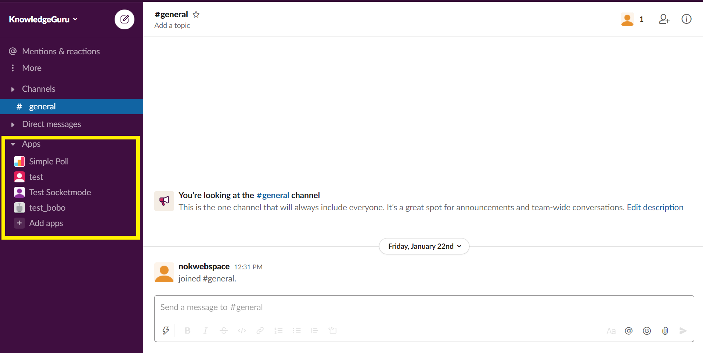

# A long awaited feature of Slack is now in Beta

Slack used to have no official way to configure your application as code. As a result, to make your SlackBot capable of doing something you used to manually activate the feature you want through Slack dedicated UI. Assuming that you had a clear of what features were out there. 

I was glad to discover earlier last week that Slack introduce in Beta **App manifest**. A easy way to configure your app from a configuration file that you can keep alongside your code.

> Use our app manifest system to create, configure, and copy your Slack apps with ease. [official documentation](https://api.slack.com/reference/manifests)

The reason I was so pleased to discover the feature is that I always found difficult to navigate through Slack administration UI and documenttion, but this new feature litteraly act as an index of all the feature you might want to learn about when creating a Slack Application.

Therfore want this article to not only introduce **App Manifest** but also to act as a glossary of all Slack Application feature.

## Overview of Slack App Manifest

Below is an example of the manifest generated by Slack for one of my project. We can notice four important sections `display_information`, `features`, `oauth_config`, `settings`. Latter I will be digging into each of these features but fiest lets see how we can use our newly generated App manifest.

```yaml
_metadata:
  major_version: 1
  minor_version: 1
display_information:
  name: Test Socketmode
features:
  app_home:
    home_tab_enabled: true
    messages_tab_enabled: true
    messages_tab_read_only_enabled: false
  bot_user:
    display_name: Test Socketmode
    always_online: false
  slash_commands:
    - command: /rocket
      description: Launches the rocket
      should_escape: false
oauth_config:
  scopes:
    bot:
      - app_mentions:read
      - channels:history
      - chat:write
      - links:read
      - reactions:write
      - users:read
      - channels:read
      - groups:read
      - commands
settings:
  event_subscriptions:
    bot_events:
      - app_home_opened
      - app_mention
      - member_joined_channel
      - message.channels
  interactivity:
    is_enabled: true
  org_deploy_enabled: false
  socket_mode_enabled: true
  is_hosted: false
```

Creating a fully configure app from a manifest is a simple three step process. I can totally I magine commiting my App manifest along side the code with the code for a Bot. No need to write a long documentation of what need to be configure for the Bot to work. This YAML document is self explainatory.


Additionnaly they are already provide three example App Manifest. These example are comming alongside a tutorial. Indeed that feature is great to boostrap the Bot and remove the tidious setup par of any tutorial. See by yoursel:
* [Publish interactive notifications](https://api.slack.com/tutorials/tracks/actionable-notifications)
* [Post messages on a schedule](https://api.slack.com/tutorials/tracks/scheduling-messages)
* [Collecting product feedback](https://api.slack.com/tutorials/tracks/collecting-feedback)

I am sure that now on each tutorial will have a pre-defined app manifest helping the reader to get setup in a few clicks. However as of now I do not see the option of edition the configuration from the App manifest section, meaning that you will still have to use the UI to update the configuration of an existing Application. Lets hope the update feature comes in the future. It this point the feature is more a boostrap configuration than a GitOps type of configuration.


## Deep Dive into Slack App Configuration

### Informations

The general information for you appliacation can be define under `display_information`. Those informations will be reflected in [App directory](https://slack.com/intl/en-ca/apps") (aka. Slack App Marketplace) and in the About section of the [App Home](https://api.slack.com/start/overview#app_home).


```yaml
display_information:
  name: Lorem ipsum
  long_description: Lorem ipsum dolor sit amet, consectetur adipiscing elit. Vivamus vel lobortis magna. Pellentesque ac dolor vel nibh hendrerit convallis. Praesent nec ligula facilisis, fringilla nulla vitae, pretium neque. Nulla ut mauris sit amet felis dictum commodo. Sed eu viverra diam. Nulla quis dignissim libero.
  description: Lorem ipsum dolor sit amet, consectetur adipiscing elit.
  background_color: "#0000AA"
```

### Oauth Config (Web API)

Everything you want to do with [Slack Web API](https://api.slack.com/methods) requires a specific `scope`; Whether you wish to post a message in a channel with [chat.postMessage](https://api.slack.com/methods/chat.postMessage) or get the user's name using [user.info](https://api.slack.com/methods/users.info) to personalize a message, you need to add the require `scopes`, For instance:

```yaml
oauth_config:
  scopes:
    bot:
      - chat:write
      - users:read
```

### Settings (Event API and Interactive Messages)

From where I stand `settings` seem to group everything that touchs to the event driven part of Slack namely [Slack Event API](https://api.slack.com/apis/connections/events-api) amd [Slack Interactive Messages](https://api.slack.com/interactivity)

With App manifest it becomes strait forward to activate interactive messages and configure callback url. 

```yaml
settings:
  socket_mode_enabled: false
  interactivity:
    is_enabled: true
    request_url: https://example.com/slack/message_action
```

Or if you do not which to expose you Slack application publicly you can use [Socket Mode](https://api.slack.com/apis/connections/socket) and subscribes to the events you want to recieve.

```yaml
settings:
  event_subscriptions:
    bot_events:
      - app_home_opened
      - app_mention
      - member_joined_channel
      - message.channels
  org_deploy_enabled: false
  socket_mode_enabled: true
  is_hosted: false
```

## Deep Dive into Slack App Features

Now we arrived to the sweat spot. There is a lot you can do just with the Event API and The Web API, everything that is conversation related lies into one of those two APIs. But what I like about Slack is those few extra feature that lets you build customise Slack Itself tu build a better expercient with your users

### App Home

[App Home](https://api.slack.com/surfaces/tabs) is that one-on-one space where Users meet your application.



App Home is composed of three different Sections:
* **Home** is a space that you can fully customise to create a UI dedicated to you Application
* **Messages** trackes all your interaction and messages with an application. This is ideal to display help messages, updates on background tasks, etc.
* **About** is where you documentation belongs, lets your userknow what your app is about and where to find related informations.

In order to use the **Home** or **Messages** section you need to unabl them. **About** is always there as it privides basic documentation about an application. Here is how you would activate each feature with App Manifest:

```yaml
features:
  app_home:
    home_tab_enabled: true
    messages_tab_enabled: true
    messages_tab_read_only_enabled: false
```


### Slash Commands

[Slash Commands](https://api.slack.com/interactivity/slash-commands) are an easy way to make your user interact with your application or enrich their experience by simply typing "/" then the name of the command. For instance, you can discover all the native Slack slash command by typing "/" into the conversation box.


One of my favorite slash command is "/giphy" and it is a good example of what you can achieve with Slack Commands.


App Manifest let you register your slack commands. You need to define the name of the command including the "/" (`command`), a description (`description`), an example of how to use the command (`usage_hint`), the url Slack should call whenever a user use the command ('url') and if mentions (@someone) channels (#channel) and links (http://abc.com) must be escaped or not.

```yaml
features:
  slash_commands:
    - command: /zork
      description: You are standing in an open field west of a white house, with a
        boarded front door. There is a small mailbox here.
      usage_hint: /zork open mailbox
      url: https://example.com/slack/slash/please
      should_escape: false
```

Note that if you are using Socket Mode `url` is not required.

### Shortcuts

[App Shortcuts](https://api.slack.com/interactivity/shortcuts) are another common way to extend Slack. 

There is two types of Shortcuts: **Global Shortcut** and **Message Shortcuts**. The first on add an additional option to the conversation bar symbolized by the ligthning symbole. The second type of short cut is reveald whenever you click on the three dots on a message.

Global shortcuts are prety strait forward and can easily replace Slack Commands. I personnally find shortcuts more userfriendly than Slack commands because they are simply added to the shortcut menu and we do not expect the user the send arguments we simply start an interactive convertation or open a model whenever the shortcut is used.

To register Shortcuts with App Manifest requires a name (`name`), a description (`description`), the type that can be either global or message (`type`) ans the callback id (`callback_id`) which is a inique identifier that Slack will send along any shortcut trigger in order or you to identify it.

```yaml
features:
  shortcuts:
    - name: zork
      description: You are standing in an open field west of a white house, with a
        boarded front door. There is a small mailbox here.
      type: message 
      callback_id: zork_actionid
```

### Workflow Steps

[Workflow Steps from App](https://api.slack.com/workflows/steps) let you extend the capability of the [Workflow Builder](https://api.slack.com/workflows#intro). Users can add these steps to their workflows and your app is called to handles execution of that step.

Integrating Workflow Steps into your Slack Application happend in two phase:
* When a user add you Step to its workflow using the Workflow Builder. Slack calls your application so you can interact with the userto let him/her to setup the Step via a Modal.
* When the step is triggered in the workflow. Slack calls you so you can perform you task and waits until wheter the task is completed or failed.

Registering a Workflow Step is strait forward and only requires a name (`name`) and a unique iditendier (`callback_id`)

```yaml
features:
  workflow_steps:
    - name: zork
      callback_id: zork_actionid
```


### Unfurl Domains

If you offer SaaS application on top of you application you may want to handle any link related to you domain. That way you can customise the message and more option related to your application. For instance JIRA application unforld all url containinf `.jira.com` dans can fetch the ticket informations instead of leting you click on the link to go to JIRA UI. Unfolding domaines let you bring the information direcly to Slack so your user don't have to do back and forth between Slack and your web application.

The configuration consist of a list of domain name.

```yaml
features:
  unfurl_domains:
      - zork.com
      - zork.dev
```


## Final Thoughts

The App manifest is made to help you create quickly a new app from a manifest or duplicate your app configuration. This feature does not support updates for now lets hope it will be added in the future.

Nontheless this is a great feature to get a cleare picture of what you application uses in terms of scope, event and features. You can save the configuration alongside your code making it easy for someone to use an opensource Slack App. You do not need to write a documentation about what needs to be configure for an application to work.

Finally, Having a unified configuration file lets you considere with one glance which features exist and may be intresting to implement into your application.

## Where to go from now?


## References

* https://api.slack.com/reference/manifests