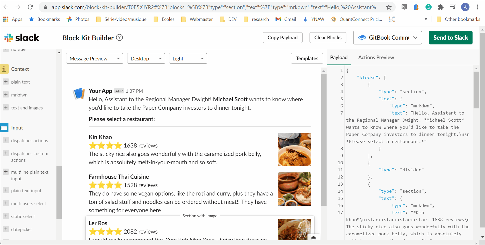
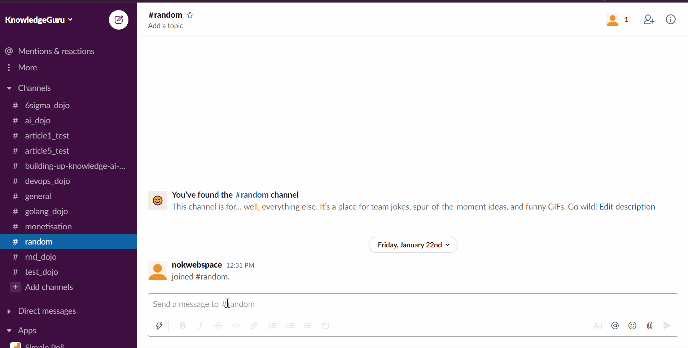
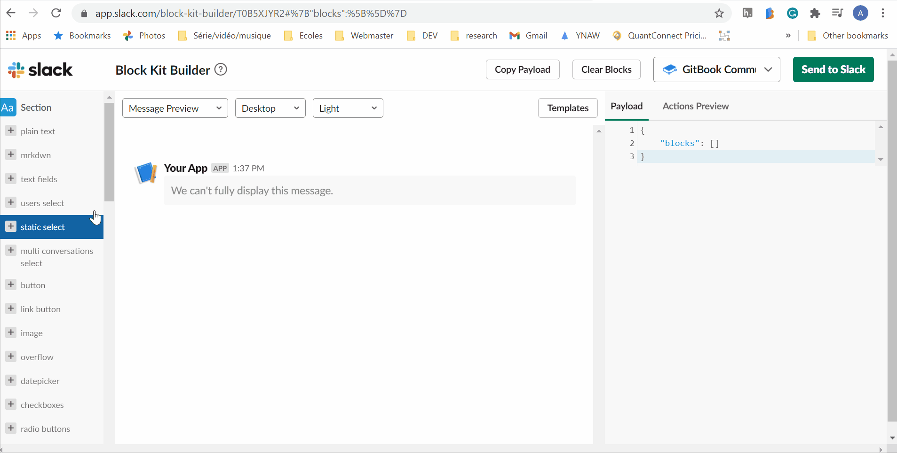

# Every Slack Application starts with a few simple steps

There is no official way to configure you application as code, so to make you bot capable to do anything you need to go through the UI to manually activate the feature you want to use. But do you have a clear idea of what features are out there?

Slack is unique in the way it was designed. They introduce their own terminology, and their API has evolved a lot in the past couple of years. Slack is depreciating ths year many "old ways" of creating applications, so I believe it is time to start fresh [Slack Changelog](https://api.slack.com/changelog/2020-01-deprecating-antecedents-to-the-conversations-api). I found it quite tricky at first to navigate, so I provided you with a glossary at the end to help you find the feature you need in the slack documentation.

## Create an application

First Step! Create a [new Application](https://api.slack.com/apps). Please give it a cool name.


## Register the scopes 

Everything you want to do with Slack requires a specific `scope`; Whether you wish to post a message in a channel with `chat.postMessage` or get the user's name using `user.info` to personalize a message. No matter which API calls you are making, you need to add that `scope` as follows:


The Slack API is well documented, so whenever you are using an endpoint for the first time, check the documentation. For instance [chat.postMessage](https://api.slack.com/methods/chat.postMessage)

It is a cornerstone of Slack security policies. Evey application States explicitly what information and which action it will be able to perform. I hope Slack provides a programmatic way to achieve that in the future.

Save your Slack Bot Token; it will be essential to start interacting with Slack:

```bash
SLACK_BOT_TOKEN=xoxb-xxxxxxxxx
```

## Using the Web API

Sending messages is most likely the one thing that every Bots do. Once you have registered your `scopes` you can start hacking and send your first message. The good new is you don't need to struggle with trial and error to designe you message. Slack created [Block Kit](https://api.slack.com/block-kit) an amazing tool that let you prototype every UI element you can send via the API.

You can find inspiration [here](https://app.slack.com/block-kit-builder/T0B5XJYR2#%7B%22blocks%22:%5B%7B%22type%22:%22section%22,%22text%22:%7B%22type%22:%22mrkdwn%22,%22text%22:%22Hello,%20Assistant%20to%20the%20Regional%20Manager%20Dwight!%20*Michael%20Scott*%20wants%20to%20know%20where%20you'd%20like%20to%20take%20the%20Paper%20Company%20investors%20to%20dinner%20tonight.%5Cn%5Cn%20*Please%20select%20a%20restaurant:*%22%7D%7D,%7B%22type%22:%22divider%22%7D,%7B%22type%22:%22section%22,%22text%22:%7B%22type%22:%22mrkdwn%22,%22text%22:%22*Farmhouse%20Thai%20Cuisine*%5Cn:star::star::star::star:%201528%20reviews%5Cn%20They%20do%20have%20some%20vegan%20options,%20like%20the%20roti%20and%20curry,%20plus%20they%20have%20a%20ton%20of%20salad%20stuff%20and%20noodles%20can%20be%20ordered%20without%20meat!!%20They%20have%20something%20for%20everyone%20here%22%7D,%22accessory%22:%7B%22type%22:%22image%22,%22image_url%22:%22https://s3-media3.fl.yelpcdn.com/bphoto/c7ed05m9lC2EmA3Aruue7A/o.jpg%22,%22alt_text%22:%22alt%20text%20for%20image%22%7D%7D,%7B%22type%22:%22section%22,%22text%22:%7B%22type%22:%22mrkdwn%22,%22text%22:%22*Kin%20Khao*%5Cn:star::star::star::star:%201638%20reviews%5Cn%20The%20sticky%20rice%20also%20goes%20wonderfully%20with%20the%20caramelized%20pork%20belly,%20which%20is%20absolutely%20melt-in-your-mouth%20and%20so%20soft.%22%7D,%22accessory%22:%7B%22type%22:%22image%22,%22image_url%22:%22https://s3-media2.fl.yelpcdn.com/bphoto/korel-1YjNtFtJlMTaC26A/o.jpg%22,%22alt_text%22:%22alt%20text%20for%20image%22%7D%7D,%7B%22type%22:%22section%22,%22text%22:%7B%22type%22:%22mrkdwn%22,%22text%22:%22*Ler%20Ros*%5Cn:star::star::star::star:%202082%20reviews%5Cn%20I%20would%20really%20recommend%20the%20%20Yum%20Koh%20Moo%20Yang%20-%20Spicy%20lime%20dressing%20and%20roasted%20quick%20marinated%20pork%20shoulder,%20basil%20leaves,%20chili%20&%20rice%20powder.%22%7D,%22accessory%22:%7B%22type%22:%22image%22,%22image_url%22:%22https://s3-media2.fl.yelpcdn.com/bphoto/DawwNigKJ2ckPeDeDM7jAg/o.jpg%22,%22alt_text%22:%22alt%20text%20for%20image%22%7D%7D,%7B%22type%22:%22divider%22%7D,%7B%22type%22:%22actions%22,%22elements%22:%5B%7B%22type%22:%22button%22,%22text%22:%7B%22type%22:%22plain_text%22,%22text%22:%22Farmhouse%22,%22emoji%22:true%7D,%22value%22:%22click_me_123%22%7D,%7B%22type%22:%22button%22,%22text%22:%7B%22type%22:%22plain_text%22,%22text%22:%22Kin%20Khao%22,%22emoji%22:true%7D,%22value%22:%22click_me_123%22,%22url%22:%22https://google.com%22%7D,%7B%22type%22:%22button%22,%22text%22:%7B%22type%22:%22plain_text%22,%22text%22:%22Ler%20Ros%22,%22emoji%22:true%7D,%22value%22:%22click_me_123%22,%22url%22:%22https://google.com%22%7D%5D%7D%5D%7D)



You can check the list of API methods [here](https://api.slack.com/methods). There is more than a hundred. I hope the rest of this article helps you filter them out to Start Building your App and leverage Slack Application to their full potential.

## Subscribe to Events (Event API)

Now that you can send a message and using the API, you may wonder. How do I make my application more interactive? The answer is simply to listen to your customers!

Like the Web API, before doing anything, you need first to activate the Event API and subscribe to an event you want to receive (aka. when do you want Slack to call you).

Let say you want to send a greeting message whenever a new member joins a specific channel. Then you need to listen to `member_joined_channel` event. Everytime you register for an event refer yourself to the documentation as you may need to add aditionnal scope to your application. For Instance [member_joined_channel documentation](https://api.slack.com/events/member_joined_channel)

To use the Event API, you need to have a public domain of IP available. It may not be ideal for you. Especially if you want to keep your Slack Bot on a Raspberry Pi or if, as a company, you have security concerns and wish to keep your bot behind your corporate firewall. The solution: Socket Mode.

### Activating Socket Mode

For those of you that build SlackBot in the past `Socket Mode` replaces [Real Time Messaging (RTM) API](https://api.slack.com/rtm) that do not support some of the best feature of Slack such as Block Kit and shortcuts.

Socket Mode can be toggle on and off at anythime and the payload are identical to the standart Event API. Therefore you can also use it for development purposes.


Don't forget to save your slack tokens. You will need them. You should have two types of token now.

```bash
SLACK_APP_TOKEN=xapp-xxxxxxxxx
SLACK_BOT_TOKEN=xoxb-xxxxxxxxx
```

## Register Slack Commands

You may be familiar with Slack Built in commandes. If not go to any conversation type `/` a first time, then `/` a second time and you will see all the availiable commandes in your wrospace.




## Register ShortCuts


## Manage Interactive messages

Slack let's add interactive components to your messages such as buttons, text fields, drop-down menu, date picker, and many more. Discover the complete list of interactive components go back to [Block Kit](https://api.slack.com/block-kit), and pay a close look at the Action section.

It is crucial to notice in Block Kit that if you interact with a component, then you will find in the `Actions Preview` the expected payload that Slack would have sent you. You know exactly what to expect on your end when a user interacts with one of your messages



When crafting an interactive message, you need to be extra cautious about `action_id` and `block_id`; they are a unique identifier that you will need to distinguish user interaction with your messages respectively and dynamically modify a message, respectively. I advise you to carefully manage those two elements in your application.

## Interactive App Home

## Links to understand Slack Terminology

Slack Applications:
* [Socket Mode](https://api.slack.com/apis/connections/socket)
* [App Directory](https://slack.com/apps)

Slack Messaging:
* [Messages](https://api.slack.com/surfaces/messages)
* [Ephemeral messages](https://api.slack.com/messaging/managing#ephemeral)
* [Block-kit](https://api.slack.com/block-kit)

Slack Features:
* [App Home](https://api.slack.com/start/overview#app_home)
* [App Home Tabs](https://api.slack.com/surfaces/tabs)
* [Slash command](https://api.slack.com/interactivity/slash-commands)
* [Shortcuts](https://api.slack.com/interactivity/shortcuts#)
* [Interaction](https://api.slack.com/interactivity/components)
* [Workflows](https://api.slack.com/workflows)