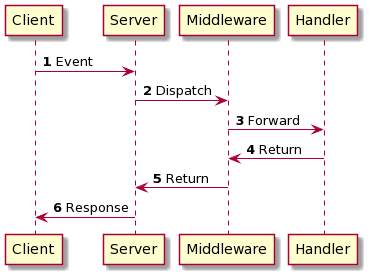

# Handler and Middleware design pattern in Golang

<p>
<span><b>Published version:</b></span>
<a href="https://medium.com/codex/handler-and-middleware-design-pattern-in-golang-de23ec452fce?sk=0eed25a60858ad985ad22274505fb992"></a>
<a href="https://dev.to/xnok/handler-and-middleware-design-pattern-in-golang-5dam"></a>
</p>

I recently started working on a SlackBot project of my own using *Golang*. As any good coder would, I went on a quest for a library that would simplify my day and let me take advantage of what other community members have come up with to solve similar problems.

I came across the well-maintained [slack-go](https://github.com/slack-go/slack) library; I started coding my bot using the provided example. Everything worked fine; The code is producing the expected result. It is time to make another coffee and implements a few extra features.

Back at my desk, plunging myself bask into my code, something strikes me. Wait a minute! This working way does not feel quite right, though. When coding REST APIs, I do not have to write any complex logic to handle my event because `net/http` is designed to help me handle HTTP requests. How can I leverage that design pattern to simplify my life and make my code more clean and flexible? I concluded.

In general, when using third-party libraries, always ask yourself if there is no better way to work and learn several design patterns. I will make you significantly more efficient by preventing you from reinventing the wheel.

Any library providing event parsing should also adopt a Handler, Middleware approach; It would feel natural for most programmers because it is the foundation of most APIs.

## Overview

The  pattern Handler and Middleware design pattern (also called *Chain of Responsibility*) allows multiple functions to handle an event by decoupling sender and receiver(s). The chain can be composed of any amount of handler that follows a standard signature or interface.



1. A Server that listens to *Events* and dispatches them to the proper handler(s) function.
2. One or many middlewares that perform pre et/or post-processing of the event
3. A handler function that processes the event

### handler function

A handler or callback is a function invoked to handle a particular type of event. In Golang, it can be an anonymous function or a regular function.

```go
eventHandler.Handle(event1, func(e Event) {
	log.Printf("event Handled: %v", event1)
})
```

```go
eventHandler.Handle(event1, handler)
```

All handler functions have the same signature; for instance, in `net/http` the look like this:

```go
func(w http.ResponseWriter, r *http.Request)
```

### Middleware

A middleware handler is simply a function that wraps another handler. In other words, it's called a "middleware" because it sits in the middle between the server and the handler. This is how you would implement any middleware in Go:

```go
func ExampleMiddleware(next Handler) Handler {

	return Handler(
		func(e Event) {
			//Pre-processing goes there

			// The actual handler
			next(e Event)

			//Post-processing goes there
		}
  )
}
```

```go
eventHandler.Handle(event1, ExampleMiddleware(handler))
```

A middleware always takes as input at list one handler function and returns a handler function. This offers the most flexibility and lets you chain middlewares. For instance, you can do that:

```go
eventHandler.Handle(event1, ExampleMiddlewareFoo(ExampleMiddlewareBar(handle)))
```

## Use Case: Implementing your Handlers, Middleware system

### Designing events

First, we are going to enumerate the list of events that our system can handle. The way we create enumeration in Go is a bit different than in other programming languages. In Go, we are going to use a set of constants sharing the same `type`. Here I called it `EventType`, and it represents a string with the event's name.

```go
// type used to enumerate events
type EventType string

const (
	event1 EventType = "event1"
	event2 EventType = "event2"
)
```

Next, we define the event itself. In our example, our `Event` as a type among the list of `EventType` created above and arbitrary data.

```go
type Event struct {
	Type EventType
	Data interface{}
}
```

### Create an eventSender (for test purpose)

To test our system, we will need to create a small function to send events every 2s. `Event` are transmitted via a [channel](https://tour.golang.org/concurrency/2). The `eventSender` function below sends a random `Event` of type `event1` or `event2` to a channel.

> Channels are a type of thought which you can send and receive values, are great for communication among goroutines. In other words, there are perfect for sending and receive event thought your application.

```go
func eventSender(c chan EventType) {

	for {
		// Send a random event to the channel
		rand.Seed(time.Now().Unix())
		events := []EventType{
			event1,
			event2,
		}
		n := rand.Int() % len(events)

		c <- events[n] // send event to channel

		// wait a bit
		time.Sleep(2 * time.Second)
	}

}
```

### Handler and dispatcher 

We first need a struct to hold the list of events we want to listen to and which function to call whenever that event is transmitted. This struct also contains the channel used for communicating events.

```go
// Create a struct to hold config
// And simplify dependency injections
type EventHandler struct {
	// Event channel
	Events chan Event
	// hold the registedred event functionss
	EventMap map[EventType][]func(Event)
}
```

Next, we need to provide an initializing constructor for our `EventHandler`.

```go
func NewEventHandler() *EventHandler {
	eventMap := make(map[EventType][]func(Event))
	events := make(chan Event)

	return &EventHandler{
		Events:   events,
		EventMap: eventMap,
	}
}
```

Then, we can create our `Handle` function that register the *event to listen and the callback function.

```go
// register the handler function to handle an event type
func (h *EventHandler) Handle(e EventType, f func(Event)) {
	h.EventMap[e] = append(h.EventMap[e], f)
}
```

Finally, we create the `EventDispatcher` function, the core of this mechanism. The function process any event sent to a channel. When an event arrives, we check the type of the event. If any function has been registering for that `eventType`, we call all registered function for that `eventType`

```go
func (h *EventHandler) EventDispatcher() {
	for evt := range h.Events {
		log.Printf("event recieved: %v", evt)
		if handlers, ok := h.EventMap[evt.Type]; ok {
			// If we registered an event
			for _, f := range handlers {
				// exacute function as goroutine
				go f(evt)
			}
		}
	}
}
```

### Using our system

Everything is ready, we can start using our event handling system.

2. Instantiate our event Handler
3. Register which event to listen to and what function to callback
4. Start the event sender
5. Start the event dispatcher

```go
func main() {

	eventHandler := NewEventHandler()

	eventHandler.Handle(event1, func() {
		log.Printf("event Handled: %v", event1)
	})

	go eventSender(eventHandler.Events)

	eventHandler.EventDispatcher()

}
```

The result should be along those lines:


Since we only handle an event of type `event1`, only `event1` shows as `Hansled`. All is good!


## Interesting Articles tackling the same topic

* [Middleware Patterns in Go](https://drstearns.github.io/tutorials/gomiddleware/)
* [Web Handlers and Middleware in GoLang](https://sathishvj.medium.com/web-handlers-and-middleware-in-golang-2706c2ecfb75)
* [Lightweight event management implemented by Go](https://medium.com/@inhereat/lightweight-event-management-implemented-by-go-a654d59ac65)
* [The 7 Most Important Software Design Patterns](https://medium.com/educative/the-7-most-important-software-design-patterns-d60e546afb0e)