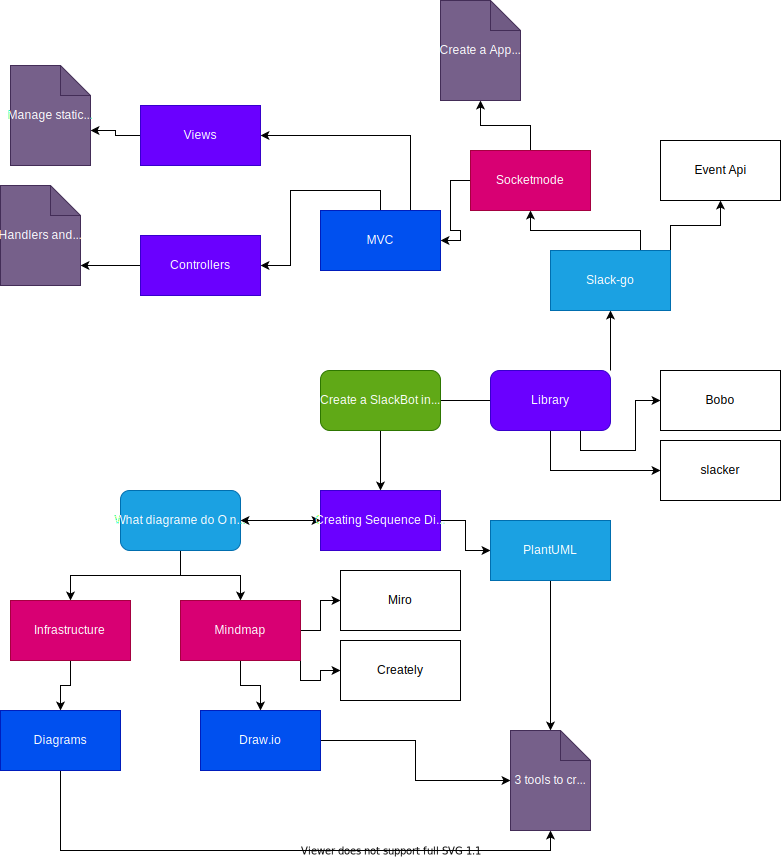

# How using diagrams as code will make you a better developer

<b>Published version:</b>

The ability to create **meaningful diagrams** is the pinnacle of communication skills for any Engineer. Forget your boring presentations or lengthy documentation. `One diagram is worth 1000 words`. So take the time to create a representation of what needs to be done: infrastructure diagrams, UML diagrams, mindmap, and others. On top of that, **do it as code**; We are in the era of everything as code, after all! 

Without a surprise, there are some delightful tools out there to do just that as code. So let me introduce to you **three tools** that combined will let you create all the diagrams you need; Two of which have VS Code extension.

Let's get things right! Before digging into your potential new playthings to add to your collection, let us take a step back and adequately review why and when you will need to create a diagram (as code).

## Overview

> Why should I equip myself with diagrams as code tools?

The most apparent motive is **better collaboration**. As mention in my introduction, visualization is the height of communication for developers. It gives us the ability to **conceptualize complex projects** in a compelling way. In that matter, it bridges the gap between the developers and the business when it comes to an understanding of **user flow and interactions** with the system. Among other diagrams, let us **visualize dependencies**. They are the most concise way to **leave a track** of analysis work done on a project. Therefore they are a pillar in **Onboarding new team members** and in some cases, helps to **identify bottlenecks or bugs** in the design or its implementation.

Suppose you don't want to waste time in the future by having your fellow engineer digging the weeds around your existing (or forgotten) code source, then create diagrams now and make everyone's life easier later.

> Then comes the question of when do I focus on that kind of activity. For the Agilist reading me, these are my recommendations

I would suggest creating diagrams whenever you start a [Story](https://www.scrum.org/resources/blog/myth-busting-what-user-story?gclid=CjwKCAjwgZuDBhBTEiwAXNofRDrQA1YuLw-Gk0sJEXWChofJeFQdF4ztUhvXcZpdL5xesqXLm7kNFhoCOjgQAvD_BwE). When improving, expanding functionality or adding new features it will help you to start with a [pair programming](https://www.agilealliance.org/glossary/pairing/) session or [mob programming](https://www.agilealliance.org/glossary/mob-programming/#q=~(infinite~true~filters~(postType~(~'page~'post~'aa_book~'aa_event_session~'aa_experience_report~'aa_glossary~'aa_research_paper~'aa_video)~tags~(~'mob*20programming))~searchTerm~'~sort~false~sortDirection~'asc~page~1)) session at least. That way, your diagrams are used to convey your ideas to fellow engineers in the hope of producing clean and efficient code. To be efficient, always prioritize agreeing on the big picture with your team.

I also advise to initiate diagrams creation during [Three Amigos](https://www.agilealliance.org/glossary/three-amigos/#q=~(infinite~false~filters~(postType~(~'page~'post~'aa_book~'aa_event_session~'aa_experience_report~'aa_glossary~'aa_research_paper~'aa_video)~tags~(~'three*20amigos))~searchTerm~'~sort~false~sortDirection~'asc~page~1)) process. Having visualization, even as a draft, is the best way to find consensus on building a solution for the problem tackled; determine if the solution is easily testable and keep track of increments done through the Agile process.

> Agile cleanic: 
> * Pair Programming
> * Mob Programming 
> * Three Amigos

## 3 Tools to add to your gears

### Architecture diagrams - Diagrams

Infrastructure visualization bridge the gap between what your **systems look like now** and the **changes needed to meet expectations**.

Lately, I went through a complete infrastructure retrospective, creating diagrams as a first step to unravel the pieces put together over the years. It ends up being a fantastic spring cleaning exercise. We found [Diagrams](https://diagrams.mingrammer.com/) a great library to perform that exercise. I realized that from now on, I should reflect all changes in the diagrams. If the diagram is alongside the code, you are more likely to edit them than if they are lost somewhere in Confluence. Besides, a diagram created as code is clean and consistent. Finally, one line of code is all you need to add any element, so no excuse for not having the time to update the diagram.

[Diagrams](https://diagrams.mingrammer.com/) are defined in python and as been implemented in Golang as well [go-diagrams](https://github.com/blushft/go-diagrams). The python version makes a clever use of the [context Manager](https://book.pythontips.com/en/latest/context_managers.html) resulting in a straightforward and readable diagram description. Especially when tackling nested infrastructure.

You can find the code of this example [here](https://github.com/xNok/infra-bootstrap-tools/blob/main/diagrams/base_architecture.py).

>  I recommend reading this article as an intraduction to this tool: [Scaling Up to Your First 10 Million Users](https://shekhargulati.com/2020/04/21/software-architecture-diagrams-as-code/). I like the approach of representing a growing infrastructure.

### UML Sequence Diagrams - PlantUML

There are 13 types of UML diagrams, but if I had to choose only one to be alongside my code, it is without a doubt a sequence diagram. The trigger for me was [that article](https://api.slack.com/tutorials/app-home-with-modal). Implementing the feature explained in the article seems so clear because they provided a simple sequence diagram. Why not embed diagrams directly in my code repository and version them with git? I thought. I had already used PlantUML in the past, and I liked its short syntax to create a sequence diagram. So when I discovered that a VS Code extension existed, it was a no-brainer. PlantUML is a must-have and will be my primary diagram tool to document my code.

Create a PlantUML sequence diagram takes only a few minutes. Think about it next time you are working on Controllers and Services; start your work session by crafting the appropriate diagrams. It would give everyone in your team a clear picture of what's going on with the code and, it will help the code review process by letting everyone better understand the context. No need for further documentation! One diagram and a few notes and comments should be all you really need.

Furthermore, by having a clear picture in your mind, you can better identify internal versus external interaction. Therefore identify potential blockers and write more testable code. I would compare creating a diagram to writing a draft for a technical article. It only takes a fraction of your time and makes you better because it stimulates you creative and critical thinking.

This is an example I used in this repo:

### Quick and flexible Diagrams - Draw.io

No matter how powerful making a diagram as code can be, sometimes we need more freedom when creating or drafting our diagrams, almost like if needed a blackboard. Luckily we can still do this in VS Code and commit the result in our git history with Draw.io. the best of both worlds! Of course, the downside is that diagram might be less structured; well, you don't want our hands tight, so I believe that this is an excellent middle ground.

I have been using [Draw.io](https://app.diagrams.net/) for many years. When I discovered a VS Code extension, I add to try it! It turns out pretty great! Your diagrams are still alongside the code, easy to open and edit in VS Code, and anyone else can always open them in the web viewer.

## References

* [Diagrams Official documentation](https://diagrams.mingrammer.com/)

* [PlantUML Official documentation](https://plantuml.com/)
* [PlantUML VS Code extention](https://marketplace.visualstudio.com/items?itemName=jebbs.plantuml)

* [Draw.io Official Website](https://app.diagrams.net/)
* [Draw.io VS Code Extention](https://marketplace.visualstudio.com/items?itemName=hediet.vscode-drawio)