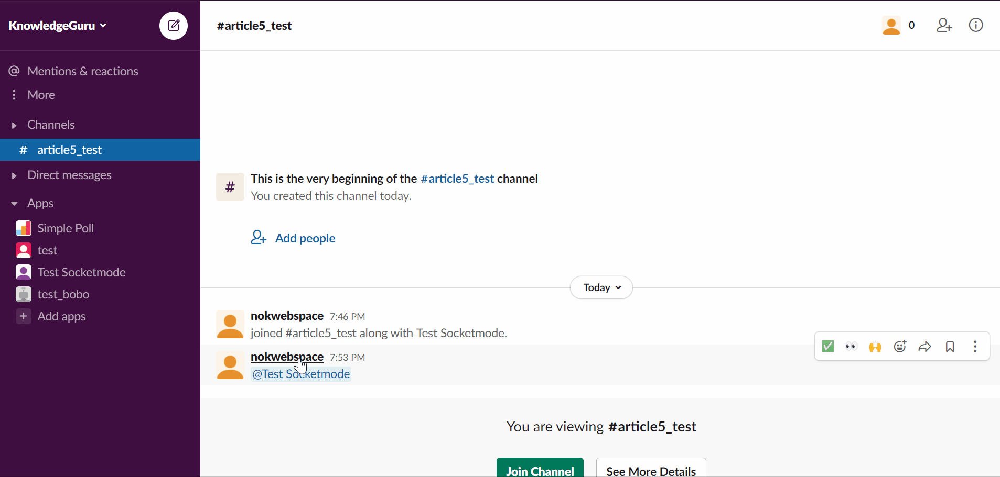
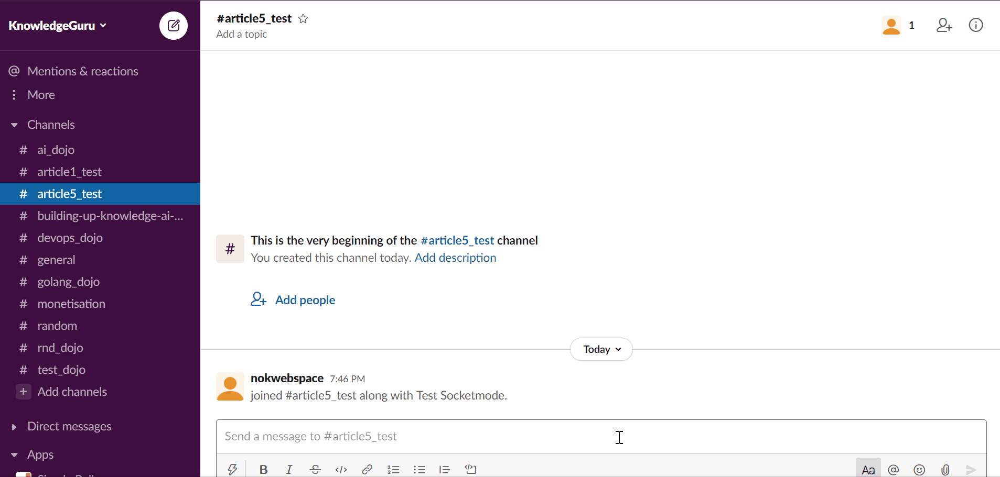
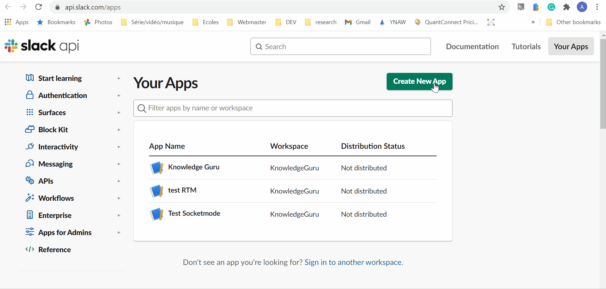
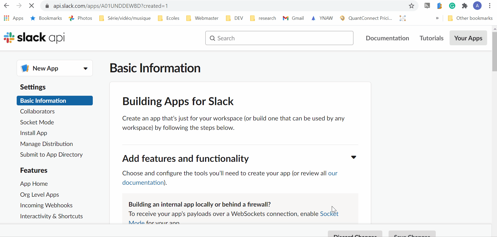
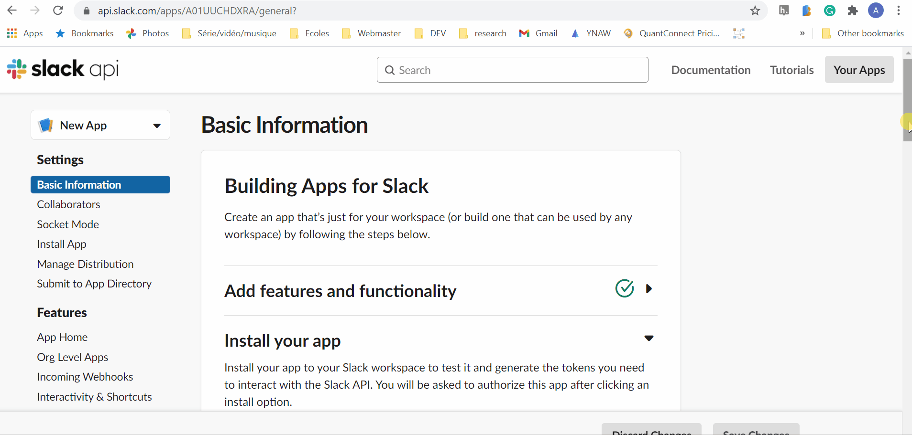

## Welcome Members in Slack with Golang using Slack Socket Mode

<p>
<span><b>Published version:</b></span>
<a href="https://levelup.gitconnected.com/properly-welcome-users-in-slack-with-golang-using-socket-mode-9a206d30a34a?sk=24fb8c44c1128cc3ef366d51d4a48812"></a>
</p>

When creating a Slack Application to increase engagement, it is essential to start small meaningful one-on-one interaction. For instance, you can send a short tutorial on how to your App in the Slack [App Home](https://api.slack.com/start/overview#app_home). You can also introduce the purpose and rules of a channel whenever a user joins, with a message only he can see as not to pollute other members.

I want this article to help you understand some core features of Slack Applications. Before moving on into coding, let me showcase two use cases and explain Slack's terminology. With this base setup, you will be able to create much more exciting interactions with your users. I consider those as the basis of any Slack application.

This tutorial guides you into implementing those two use cases I mentioned at the very beginning in Golang with the [slack-go](https://github.com/slack-go/slack) library and using [Slack Socket Mode](https://api.slack.com/apis/connections/socket).

> Why Socket Mode

You don't need a public server. In other words, your laptop, your raspberry pi, or a private server can host your bot. Socket mode is perfect for a small application that you do not intend to distribute via [App Directory](https://slack.com/apps)

### Use Case 1: Sending Ephemeral greeting message when a user joins a channel

[Ephemeral messages](https://api.slack.com/messaging/managing#ephemeral) are visible only by a specific user and are not persisted in the conversation. Those are ideal for reaction to user interaction such as joining a channel, answering with sensitive information, giving instruction, etc.



### Use Case 2: React to messages that mentioned your App or Bot with a message in your App Home

[App Home](https://api.slack.com/start/overview#app_home) is a dedicated space for your Slack Application. You can create a customized landing page, add an about page to document your App, and have a private message thread between your App and a user. Unlike Ephemeral messages, those messages will be persisted, meaning that all the tips and tricks you send will be easily accessible. Also, I personally prefer sending informative messages in the Slack App Home over sending them as a private message via a Bot. You want to convince your users that your App Home is the one place to find information about your App or Bot.



## Tutorial Step 1: Configure your Application

Create a [new Application](https://api.slack.com/apps). Please give it a cool name.



Activate Socket Mode in the appropriate section. Do not forget to save the Application token provided to you.

Activate Event Api and subscribe to the following event:
* app_mentionned
* member_join_channel



Go to `OAuth & Permissions` save the `Bot User OAuth Token` we will need it and add the following permissions:

* chat:write - let you post messages in channels
* users:read - In this example, I collect the user name to personalize the greeting message



## Tutorial Step 2: Create the project repository

First, create a new go project and import `slack-go` library.

```
go mod init
go get -u github.com/slack-go/slack
```

I use my fork of `slack-go` in this tutorial because one feature I am demonstrating has not yet been merged [#PR904](https://github.com/slack-go/slack/pull/904). 

To use a fork, we need to add a replace statement in `go.mod`:

```
replace github.com/slack-go/slack => github.com/xnok/slack
```

Then we force that change to be taken into consideration:

```
go mod tidy
```

Then you can create the following project structure or refer to it as we progress in the tutorial

```
+ controllers
|`- greetingController.go
+ drivers
|`- Slack.go
+ views
|`+ greetingViewsAssets
| | `- greeting.json
|`- greetingViews.go
+ main.go
```

I use an MVC structure and organize the files accordingly. Next, I will be explaining each of the elements and their implementation. You can find the complete code for my tutorial [here](https://github.com/xNok/slack-go-demo-socketmode). It might help to fork the code to follow along.

## Tutorial Step 3: Foundation > main.go 

The file `main.go` essentially manage initialization and dependencies. First, it read from a file the two Slack token we need:

```bash
SLACK_APP_TOKEN=xapp-xxxxxxxxx
SLACK_BOT_TOKEN=xoxb-xxxxxxxxx
```

In created a small helper `ConnectToSlackViaSocketmode` to validate those two environment variables as well as instanciating the Slack client. [See drivers/Slack.go code](../drivers/slack.go)

Then we initialize our event listener and our Controller. Finally, we start the event loop so that the application begins receiving events we subscribed to from Slack.

```go
func main() {

  // read bot token from .env file
	err := godotenv.Load("./test_slack.env")
	if err != nil {
		log.Fatal().Msg("Error loading .env file")
	}

	// Instantiate slack socket mode client
	client, err := drivers.ConnectToSlackViaSocketmode()
	if err != nil {
		log.Error().
			Str("error", err.Error()).
			Msg("Unable to connect to slack")

		os.Exit(1)
	}

	// Inject deps in event handler
	socketmodeHandler := socketmode.NewsSocketmodeHandler(client)

    // Inject deps to Controller
	controllers.NewGreetingController(socketmodeHandler)

	socketmodeHandler.RunEventLoop()

}
```

For that piece of code to do anything, we need to create our Controller so let get started.

## Tutorial Step 4: Create the controller > greetingController.go

The flow we are trying to achieve with that Controller is the following:


The top part of our Controller manages dependencies and event handling. `NewGreetingController` is the initialization constructor for `GreetingController`. It used the `EventHandler` to register which event we want to listen to and which function to callback to process it. This Slack Application uses the Handler and Middleware design pattern to tackle every event, and if you need more explanation, you can read the dedicated article [here](./2_middleware.md)


```go
type GreetingController struct {
	EventHandler *socketmode.SocketmodeHandler
}

func NewGreetingController(eventhandler *socketmode.SocketmodeHandler) GreetingController {
	c := GreetingController{
		EventHandler: eventhandler,
	}

	// App Home (2)
	c.EventHandler.HandleEventsAPI(
		slackevents.AppMention,
		c.reactToMention,
	)

	// App Home (2)
	c.EventHandler.HandleEventsAPI(
		slackevents.MemberJoinedChannel,
		c.postGreetingMessage,
	)

	return c

}
```

We will define the core logic of our bot in `reactToMention` and `postGreetingMessage`. Let's dig into it.

### reactToMention

There are five important steps in the code snippet:
  1. `*socketmode.Event` is a generic type of event, you register that function to receive `AppMentionEvent`, therefore you need to convert the incoming event, so it is more convenient to handle.
  2. You need to acknowledge that you received the message. It is specific to Socket Mode and may cause errors if you forget.
  3. We need the actual name of our User, so we use `GetUserInfo`. Slack provides only the UserID because this data may be considered sensitive.
  4. We generate your message using our View. We did not implement it yet!
  5. We send the message to our App Home. **This is the tricky part**. To send a message in your App Home you need to set the channelID as the UserID. In other words, your App Home channelID is the user UserID. I personally find that API implementation/convention a bit of a stretch, but now you Know!!  

```go
func (c *GreetingController) reactToMention(evt *socketmode.Event, clt *socketmode.Client) {
	// we need to cast our socketmode.Event into slackevents.AppMentionEvent
	evt_api, _ := evt.Data.(slackevents.EventsAPIEvent)
	evt_app_mention, ok := evt_api.InnerEvent.Data.(*slackevents.AppMentionEvent)

	clt.Ack(*evt.Request)

	if ok != true {
		log.Printf("ERROR converting event to slackevents.MemberJoinedChannelEvent: %v", ok)
	}

	userInfo, err := clt.GetApiClient().GetUserInfo(evt_app_mention.User)

	if err != nil {
		log.Printf("ERROR unable to retrive user info: %v", err)
	}

	// create the View using block-kit
	blocks := views.GreetingMessage(userInfo.Name)

	// Post greeting message (3) in User's App Home
	// Pass a user's ID as the value of channel to post to that User's App Home
	// We get the Api client from `clt`
	_, _, err = clt.GetApiClient().PostMessage(
		evt_app_mention.User,
		slack.MsgOptionBlocks(blocks...),
	)

	//Handle errors
	if err != nil {
		log.Printf("ERROR reactToMention: %v", err)
	}
}
```

### postGreetingMessage

We have the same five key points as `reactToMention` except for item 4; we send the Ephemeral Message via a dedicated function instead.

```go
func (c *GreetingController) postGreetingMessage(evt *socketmode.Event, clt *socketmode.Client) {
	// we need to cast our socketmode.Event into slackevents.AppHomeOpenedEvent
	evt_api, _ := evt.Data.(slackevents.EventsAPIEvent)
	evt_member_join, ok := evt_api.InnerEvent.Data.(*slackevents.MemberJoinedChannelEvent)

	clt.Ack(*evt.Request)

	if ok != true {
		log.Printf("ERROR converting event to slackevents.AppMentionEvent: %v", ok)
	}

	userInfo, err := clt.GetApiClient().GetUserInfo(evt_member_join.User)

	if err != nil {
		log.Printf("ERROR unable to retrive user info: %v", err)
	}

	// create the View using block-kit
	blocks := views.GreetingMessage(userInfo.Name)

	// Post greeting message (3)
	// We get the Api client from `clt`
	_, err = clt.GetApiClient().PostEphemeral(
		evt_member_join.Channel,
		evt_member_join.User,
		slack.MsgOptionBlocks(blocks...),
	)

	//Handle errors
	if err != nil {
		log.Printf("ERROR postGreetingMessage: %v", err)
	}
}
```

## Tutorial Step 5: Create the View> greetingViews.go

To make my life easy when creating Views for Slack I use a few tricks:
1. I design my UI with [Block-kit](https://api.slack.com/block-kit) exclusively and save the JSON payload in a JSON file. See `greetingViewsAssets/greeting.json` for instance.
2. I use [Go template](https://golang.org/pkg/text/template/) to render my View and inject variable elements such as user name.
3. Since Golang 1.16, I use the `embed` package to access files embedded in my project.

If you need more explanation about those tricks, you can read the dedicated article [here](./1_go_1_16_embeded.md)

Creating this View requires a few simple steps. First, rendering the template injects the user name into the message. Then you end up with a generated JSON that you can unmarshal into as Slack Message. 

```go
//go:embed greetingViewsAssets/*
var greetingAssets embed.FS

func GreetingMessage(user string) []slack.Block {

	// we need a stuct to hold template arguments
	type args struct {
		User string
	}

	tpl := renderTemplate(greetingAssets, "greetingViewsAssets/greeting.json", args{User: user})

	// we convert the View into a message struct
	view := slack.Msg{}

  // dump the renderd template into the view
	str, _ := ioutil.ReadAll(&tpl)
	json.Unmarshal(str, &view)

	// We only return the block because of the way the PostEphemeral function works
	// we are going to use slack.MsgOptionBlocks in the controller
	return view.Blocks.BlockSet
}
```

## Final thoughts

Completing this tutorial should provide you with a base to interact with your users. Technically speaking, you haven't learned from me how to send a regular message. But I believe it is essential to know how to use all communication methods offered by Slack to reduce notification fatigue. A horde of SlackBots can create a lot of noise if not well crafted.

From that point forward, you can look into more advanced features from Slack that bring your workspace's automation to the next level: App Home Tabs, Slash command, Shortcuts, Interaction, Workflows.

## Links to understand Slack Terminology

* [App Home](https://api.slack.com/start/overview#app_home)
* [Socket Mode](https://api.slack.com/apis/connections/socket)
* [App Directory](https://slack.com/apps)
* [Ephemeral messages](https://api.slack.com/messaging/managing#ephemeral)
* [Block-kit](https://api.slack.com/block-kit)
* [App Home Tabs](https://api.slack.com/surfaces/tabs)
* [Slash command](https://api.slack.com/interactivity/slash-commands)
* [Shortcuts](https://api.slack.com/interactivity/shortcuts#)
* [Interaction](https://api.slack.com/interactivity/components)
* [Workflows](https://api.slack.com/workflows)