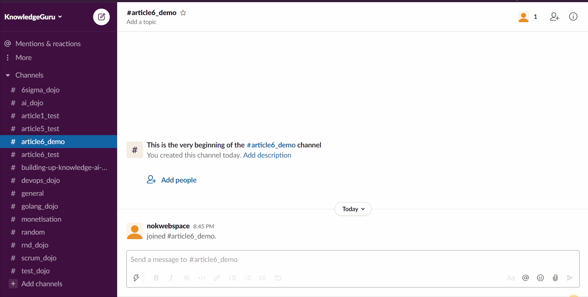

# Slack Slash Command in Golang with Socket Mode

Slash Commands are the messages you type in the conversation box starting with `"/"`. They let you easily extend the capabilities of Slack and are pretty simple to implement. I see them as ways to interact with your ecosystem by writing from your Slack Channels and then your Slack application is the orchestrator behind the scene redirecting you user request to the right system. In short I'd like to describe them as functions that you can trigger remotely from Slack. So no matter you want to add simple utilities or convert your workspace into a full-fledge ChatOps Headquarter, Slash commands are a must-have in your Slack application.


This article features a rapid introduction to slash command and a detailed explanation on how to get started in Golang using Socket Mode. The key Slack API concept demonstrated are Slack slash commands, ephemeral messages, and interactive messages.

## What can you achieve with Slash Commands?

You may be familiar with Slack Built-in commands. If not go to any conversation type `/` a first time, then `/` a second time and you will see all the available commands in your workspace.


Slack lets you create similar command for your application. You first subscribe via the slack Application backend to a command. Then you listen to that commands being fired by your users and finally start interacting with them. It is a great way to create easy to remind shortcut to let your users act. One of the most popular Slack Slash Command in my workspace is definitely `/giphy`.


Slash commands are composed of two elements. For instance, when you type `/rocket count=5`, the message is split in two by Slack:
* The command `/rocket` 
* The text `count=5`

The command segment helps you dispatch the user request to the correct Service, or Controller and the text part will need to be parsed so your application can make sense of it. If you write a conventional command-line interface, you may expect `key=value` arguments. But be careful; your user can enter anything after the command, so always provide a help message explaining how the command line works whenever its arguments are incorrect. The good news is Slack interactivity; when a command is wrong, you can also send an interactive message or open a modal to collect the required information. I found that the second approach more user-friendly.

This is an overview of the command you will be creating with this tutorial:



## Tutorial Step 1 to 3: Getting ready

I have already written a couple of articles on creating Slack Bot, and those few essential steps (1 to 3) ended up being identical. So I will introduce to you briefly what to need to do to get ready. If you have any interrogation, please read the dedicated article.

### Step 1

1. Create Your [new Application](https://api.slack.com/apps)
2. Activate Socket Mode in the appropriate section
3. Register the OAuth scope you need:
	* chat:write - let you post messages in channels
4. Register a Slash Command

This gif demonstrates how to register a new Slask Command. For this example, I named it `/rocket`.


### Step 2

Create the project structure. Each subsequent section will focus on one of these files.

```
+ controllers
|`- slashCommandController.go
+ drivers
|`- Slack.go
+ views
|`+ slackCommandAssets
| | `- rocket.json
|`- slashCommandView.go
+ main.go
```

### Step 3

1. Create the driver/slack.go (or copy from [here](../drivers/slack.go))
2. Create the main.go (or copy from [here](../main.go))

## Tutorial Step 4: Create the controller > slashCommandController.go

The following flow chart describes the controller behavior:
* receive a Slack Command `/rocket` then send an ephemeral interactive message
* If the user is approved, update the message to display the rocket launch count down


### Setting up the controller

We start by creating an initialization constructor. This method uses `*socketmode.SocketmodeHandler` to register events we want to receive and which function will handle it. In this case we are listening to two event:
* The Slash command "/rocket" that will be handled by `c.launchRocketAnnoncement`
* The interaction with the `approved` button of our message will be handled by `c.launchRocket`. This button is part of an "Interactive Block" and uniquely identified by an ActionID represented by the constant `views.RocketAnnoncementActionID`. I use a constant here because I want to make sure the `ActionID` I am listening for is defined in the message we send after the user calls the `/rocket` command.

```
// We create a structure to let us use dependency injection
type SlashCommandController struct {
	EventHandler *socketmode.SocketmodeHandler
}

func NewSlashCommandController(eventhandler *socketmode.SocketmodeHandler) SlashCommandController {
	// we need to cast our socketmode.Event into a SlashCommand
	c := SlashCommandController{
		EventHandler: eventhandler,
	}

	// Register callback for the command /rocket
	c.EventHandler.HandleSlashCommand(
		"/rocket",
		c.launchRocketAnnoncement,
	)

	// The rocket launch is approved
	c.EventHandler.HandleInteractionBlockAction(
		views.RocketAnnoncementActionID,
		c.launchRocket,
	)

	return c

}
```

### Responding to `rocket` with an Ephemeral message

the key points to code this function are the followings:
1. You need to cast the generic `socketmode.Event` you received into a `slack.SlashCommand`
2. You need to acknowledge that you received the event. (Slack expects you to replay within 3s)
3. You need to create the message you will send. I will cover this part later on with the function `views.LaunchRocketAnnoncement`.
4. You need to send you message via Slack API. Two Option are available for this action. The first is the use of the standard API `chat.postmessage`. The second is to use the Response URL provided in the Slash Command. (More details about Response URL in the next section)

```
func (c SlashCommandController) launchRocketAnnoncement(evt *socketmode.Event, clt *socketmode.Client) {
	// we need to cast our socketmode.Event into a Slash Command
	command, ok := evt.Data.(slack.SlashCommand)

	if ok != true {
		log.Printf("ERROR converting event to Slash Command: %v", ok)
	}

	// Make sure to respond to the server to avoid an error
	clt.Ack(*evt.Request)

	// parse the command line (Hardcoded in this example)
	count := 3

	// create the view using block-kit
	blocks := views.LaunchRocketAnnoncement(count)

	// Post ephemeral message
	_, _, err := clt.GetApiClient().PostMessage(
		command.ChannelID,
		slack.MsgOptionBlocks(blocks...),
		slack.MsgOptionResponseURL(command.ResponseURL, slack.ResponseTypeEphemeral),
	)

	// Handle errors
	if err != nil {
		log.Printf("ERROR while sending message for /rocket: %v", err)
	}

}
```

### Reacting to user action on the approve button

The structure of the method is similar to the previous one. If you can code one, you can code the one as well.

```
func (c SlashCommandController) launchRocket(evt *socketmode.Event, clt *socketmode.Client) {
	// we need to cast our socketmode.Event into an Interaction Callback
	interaction := evt.Data.(slack.InteractionCallback)

	// Make sure to respond to the server to avoid an error
	clt.Ack(*evt.Request)

	// parse the command line
	count := 3

	for i := count; i >= 0; i-- {
		// create the view using block-kit
		blocks := views.LaunchRocket(i)

		// count down by steps of 1s
		time.Sleep(1000 * time.Millisecond)

		_, _, err := clt.GetApiClient().PostMessage(
			interaction.Container.ChannelID,
			slack.MsgOptionBlocks(blocks...),
			slack.MsgOptionResponseURL(interaction.ResponseURL, slack.ResponseTypeInChannel),
			slack.MsgOptionReplaceOriginal(interaction.ResponseURL),
		)

		// Handle errors
		if err != nil {
			log.Printf("ERROR while sending message for /rocket: %v", err)
		}
	}

}
```

### More about Response URL

Response URL is basically a webhooks that let you interact with a user up to 5 replies in 30 min. Response URL are provided by Slack whenever a Slash command or an interactive message are triggered.

When using the response URL you have two option:
* Respond to the channel so everyone can see the Bot's response ` Slack.ResponseTypeInChannel`
* Respond with an ephemeral message and only the user that triggered the command see it `slack.ResponseTypeEphemeral`

In this case we add a `MsgOption` to our `PostMessage` call:

```
slack.MsgOptionResponseURL(command.ResponseURL, slack.ResponseTypeInChannel)
```

It is essential to mention that the Response URL lets you post a message in a channel event if your Bot hasn't been added to the channel. Indeed [chat.postMessage](https://api.slack.com/methods/chat.postMessage) only lets you post a message to a channel your Bot has been added to; otherwise, you receive the error `not_in_channel`. In other words, a Response URL grants you access to interact with a user regardless of the usual permission you have (a limited number of times, of course, for security).

Other options to consider when creating commands:
* Schedule a message (if your app creates some kind of reminder)
* Send the Message in the [App Home](https://api.slack.com/start/overview#app_home). I prefer this approach to the ephemeral message because it leaves traces of all your interaction with the application in a single place.
* Open a Modal using the `trigger_id` provided in `slack.SlashCommand`. This is a fascinating feature of Slack. I prefer that approach to parsing parameters in the command line; it is much more user-friendly for non-developers.

## Tutorial Step 5: Create the View > slashCommandView.go

Last but not least, we need to learn how to generate our Slack message. Slack introduce [Block-kit](https://api.slack.com/block-kit) to help us create our messages without trial and errors. My approach to handle slack message is to Save the Block-kit payload as a JSON file and then use [Go template](https://golang.org/pkg/text/template/) to render my View and inject variable.

I wrote a dedicated article on the subject., you can read the dedicated article [here](./1_go_1_16_embeded.md)

You can fine tune the massage in Block-kit [here](https://app.slack.com/block-kit-builder/T0B5XJYR2#%7B%22blocks%22:%5B%7B%22type%22:%22section%22,%22text%22:%7B%22type%22:%22mrkdwn%22,%22text%22:%22*You%20are%20about%20to%20lauch%20a%20new%20rocket*%22%7D%7D,%7B%22type%22:%22section%22,%22fields%22:%5B%7B%22type%22:%22mrkdwn%22,%22text%22:%22*Rocket:*%5CnFalcon%209%22%7D,%7B%22type%22:%22mrkdwn%22,%22text%22:%22*When:*%5Cn3s%20count%20down%22%7D%5D%7D,%7B%22type%22:%22actions%22,%22elements%22:%5B%7B%22type%22:%22button%22,%22text%22:%7B%22type%22:%22plain_text%22,%22emoji%22:true,%22text%22:%22Approve%22%7D,%22style%22:%22primary%22,%22value%22:%22click_me_123%22%7D,%7B%22type%22:%22button%22,%22text%22:%7B%22type%22:%22plain_text%22,%22emoji%22:true,%22text%22:%22Deny%22%7D,%22style%22:%22danger%22,%22value%22:%22click_me_123%22%7D%5D%7D%5D%7D). The save the payload as a JSON file called `slackCommandAssets/annoncement.json`.

The key point to creating this View are:
1. Render the template injects the user name into the message. I created a small utility function to do that as I reuse it in every view. [views/utils.go](../views/utils.go). The argument used in the template are: the number of second in the count down `{{ .Number }}`, a unique identifier for the approve button we talked about when creating the controller.
2. Unmarshal the generated message into a Slack Message. 

```go
func LaunchRocketAnnoncement(number int) []slack.Block {
	// we need a stuct to hold template arguments
	type args struct {
		Number   int
		ActionID string
	}

	my_args := args{
		Number:   number,
		ActionID: RocketAnnoncementActionID,
	}

	tpl := renderTemplate(slashCommandAssets, "slackCommandAssets/annnoncement.json", my_args)

	// we convert the view into a message struct
	view := slack.Msg{}

	str, _ := ioutil.ReadAll(&tpl)
	json.Unmarshal(str, &view)

	// We only return the block because of the way the PostEphemeral function works
	// we are going to use slack.MsgOptionBlocks in the controller
	return view.Blocks.BlockSet

}
```

### Next Steps

## Try this app

Once you have successfully completed the tutorial, you can run your app:

```
go run ./main.go
```

You can also directly clone [my repository](https://github.com/xNok/slack) to try it beforehand.
## Can You Improve It?

Once completed this tutorial, you have a reasonably solid foundation for all subsequent Slack commands. Not only did you learn about slash commands but also about sending messages (regular and ephemeral), using Block-kit, and creating an interactive message. But do you remember I mentioned that modal would be the preferred way to collect user's input over command line argument? Well, this is a good follow-up challenge:
* Add a button to the ephemeral message (configure the rocket, for instance)
* Open a Modal to offer configurable options (make the count down configurable, for instance)

## References

* https://api.slack.com/interactivity/slash-commands
* https://api.slack.com/legacy/interactive-messages