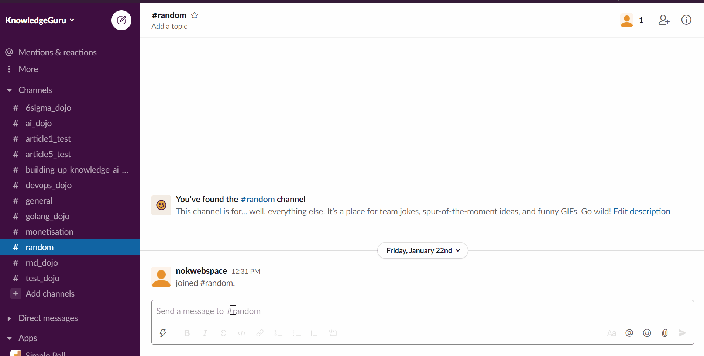

# Slack Slash Command in Golang with Socket Mode

Slash Commands are messages starting with `/`. They lets you easily extend the capablilities of Slack and are quite simple to implement. This are a simple way to interact with your ecosystem by writing from you Slack Channels. I'd like to see them as function that you can trigger remotly from Slack. So no matter you want to add simple utilities or convert your workspace into a full fledge ChatOps Head quarter, Slack Slash Commands are a must have.


In this article, I will make rapid introdcution to slash command and a detailed explanation on how to get started in Golang using Socket Mode.

> Why Should You use Socket Mode 

Socket Mode is more convenient and secure for companies and small personal projects. You don't need to expose your Bot over the internet. In other words, your laptop, your raspberry pi, or a private server can host your Bot. Socket mode is perfect so long that you do not intend to distribute via [App Directory](https://slack.com/apps).

## What can you achieve with Slash Commands

You may be familiar with Slack Built in commandes. If not go to any conversation type `/` a first time, then `/` a second time and you will see all the availiable commandes in your workspace.



Slack let you create similar command for your application. You then listen to commands behing fired by you users and start interactic with them. It is a great way to create easy to remimde shortcut to let you users perform action. One of the most popular Slack Command in my workspace is definitly `/giphy`

Slash commands are composed of two elements. For instance, when you type `/rocket count=5`:
* The command `/rocket` 
* The text `count=5`

The command will help you dispatch the user request to the right place and you will ne to parse the text to make sense of what the user want. If you write a more conventional command line interface you may expect `key=value` arguments.


## Tutorial Step 1 to 3: Getting ready

I have already written a couple of articles on creating Slack Bot, and those few essential steps ended up being identical. So lets me introduce to you briefly want you to need to do to get ready. If you have any interrogation, please read the dedicated article.

### Step 1

1. Create Your [new Application](https://api.slack.com/apps)
2. Activate Socket Mode in the appropriate section
3. Register the Oauth scope you need:
	* chat:write - let you post messages in channels
4. Create A slash Command

This gif demonstrates how to register a new Slask Command. For this example, I simply named it \rocket.


### Step 2

1. Create the project structure

```
+ controllers
|`- slashCommandController.go
+ drivers
|`- slack.go
+ views
|`+ slackCommandAssets
| | `- rocket.json
|`- slashCommandView.go
+ main.go
```

### Step 3

6. Create the driver/slack.go (or copy from [here](../drivers/slack.go))
7. Create the main.go (or copy from [here](../main.go))

## Tutorial Step 4: Create the controller > slashCommandController.go

### Callback url (up to 5 reply in 30 min)

When using the response URL you have two option:
* Respond to the channel so everyone can see the Bot's response `slack.ResponseTypeInChannel`
* Respond with ephemeral Message and only the user that triggered the command see it `slack.ResponseTypeEphemeral`

```
slack.MsgOptionResponseURL(command.ResponseURL, slack.ResponseTypeInChannel)
```

It is important to mentionned that the Response URL let you post a message in a channel event if your Bot hasnt been added to the channel. Indeed [chat.postMessage](https://api.slack.com/methods/chat.postMessage) only let you post a message to a channel you Bot has been added to otherwise you recive the error `not_in_channel`. In otherwords, Response URL grant you access to interact with a user regardless of the usual permission you have (a limited number of time of course, for security).

Other options to consider when creating commands:
* Schedule a message (if your app creates some kind of reminder)
* Send the Message in the [App Home](https://api.slack.com/start/overview#app_home). I prefer this approach to the ephemeral Message because it leaves a track of all your interaction with the application in a single place.
* Open a Modal using the `trigger_id` provided in `slack.SlashCommand`. This is a very exiting feature of Slack. I prefer that approach to persing parameters in the command line, it is much more userfriendly for non developers.

## Tutorial Step 5: Create the View > slashCommandView.go


### Next Steps

## Try this app

Once you have successfully completed the tutorial, you can run your app:

```
go run ./main.go
```

You can also directly clone [my repository](https://github.com/xNok/slack) to try it beforehand.
## Can You Improve It?

Once completed this tutorial, you have a reasonably solid foundation for all subsequent Slack commands. Not only did you learn about slash commands but also about sending messages (regular and ephemeral), using Block-kit, and creating an interactive message. But do you remember I mentioned that modal would be the preferred way to collect user's input over command line argument? Well, this is a good follow-up challenge:
* Add a button to the ephemeral Message (configure the rocket, for instance)
* Open a Modal to offer configurable options (make the count down configurable, for instance)

## References

* https://api.slack.com/interactivity/slash-commands
* https://api.slack.com/legacy/interactive-messages