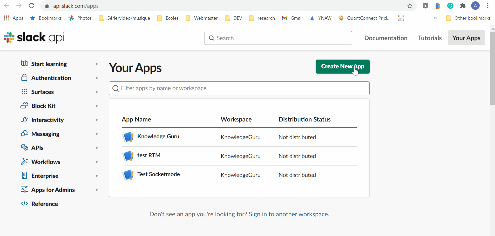

## Tutorial Step 1: Configure your Application

Create a [new Application](https://api.slack.com/apps). Please give it a cool name.



Activate Socket Mode in the appropriate section. Do not forget to save the Application token provided to you.

Register a new Slask Command. For this example, I simply named it \rocket.


Go to `OAuth & Permissions` save the `Bot User OAuth Token` we will need it and add the following permissions:

* chat:write - let you post messages in channels
* users:read - In this example, I collect the user name to personalize the greeting message


## Tutorial Step 2: Create the project repository

First, create a new go project and import `slack-go` library.

```
go mod init
go get -u github.com/slack-go/slack
```

I use my fork of `slack-go` in this tutorial because one feature I am demonstrating has not yet been merged [#PR904](https://github.com/slack-go/slack/pull/904). 

To use a fork, we need to add a replace statement in `go.mod`:

```
replace github.com/slack-go/slack => github.com/xnok/slack
```

Then we force that change to be taken into consideration:

```
go mod tidy
```

Then you can create the following project structure or refer to it as we progress in the tutorial

```
+ controllers
|`- slashCommandController.go
+ drivers
|`- Slack.go
+ main.go
```

## More on Slash Command

Slash commands are composed of two elements. For instance when you type `/rocket tell me where you are`:
* the command `/rocket` 
* The text `tell me where you are`

The command will help you dispatch the user request to the right place and you will ne to parse the text to make sense of what the user want. If you write a more conventional command line interface you may expect `key=value` arguments.


### Callback url (up to 5 reply in 30 min)

When using the response URL you have two option:
* Respond to the channel so everyone can see the Bot's response `slack.ResponseTypeInChannel`
* Respond with ephemeral message and only the user that triggered the command see it `slack.ResponseTypeEphemeral`

```
slack.MsgOptionResponseURL(command.ResponseURL, slack.ResponseTypeInChannel)
```

Other options to considere when creating commands:
* schedule a message (if your app creates some king of reminder)
* Send the message in the App Home

### How to properly reply to slash commands

## References

* https://api.slack.com/interactivity/slash-commands
* https://api.slack.com/legacy/interactive-messages