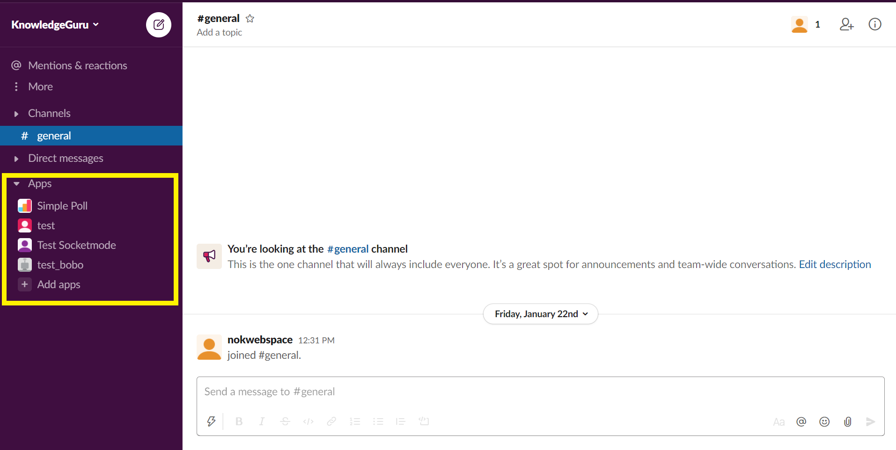
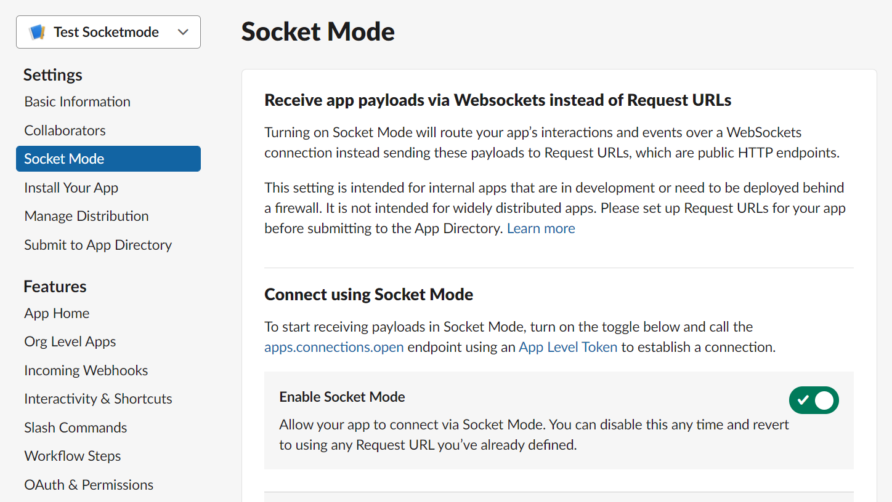
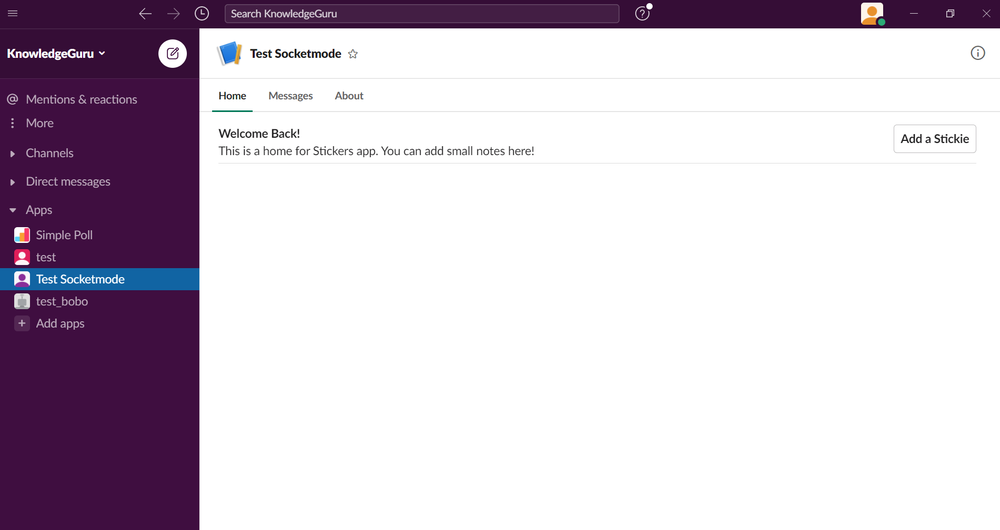
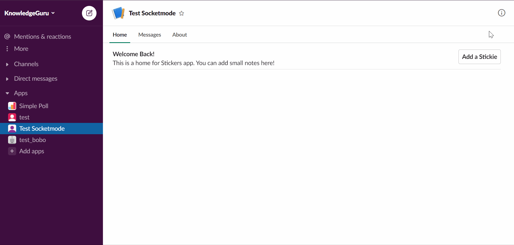
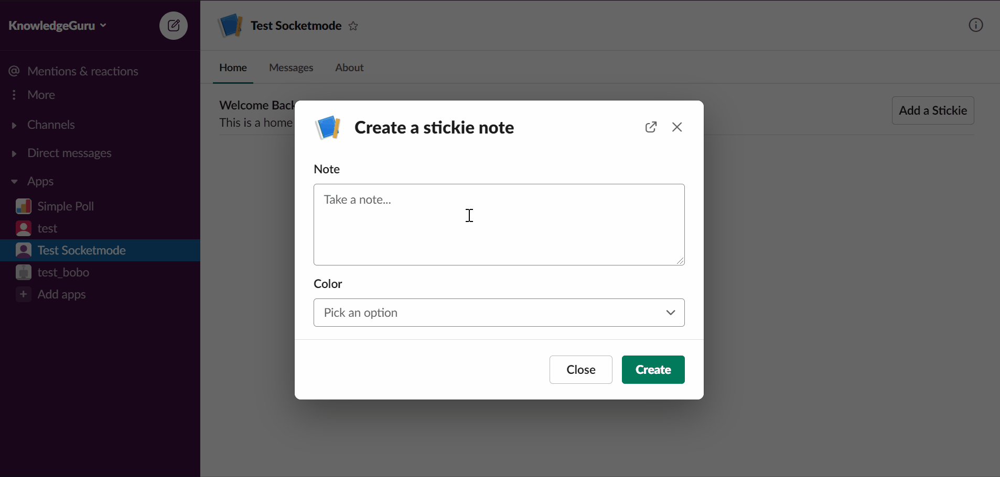

# Create Slack App Home in Golang using Slack Socket Mode

<p>
<a href="https://betterprogramming.pub/build-a-slack-app-home-in-golang-using-socket-mode-aff7b855bb31?sk=b8b1f7f3c03972793b26bec02dc3d2cc"></a> 
<a href="https://dev.to/xnok/build-your-slack-app-home-in-golang-using-socket-mode-4o5e"></a>
</p>


This tutorial feature implementing an [App Home](https://api.slack.com/start/overview#app_home) in Golang with the [slack-go](https://github.com/slack-go/slack) library and using [Slack Socket Mode](https://api.slack.com/apis/connections/socket). It is inspired by this [article](https://api.slack.com/tutorials/app-home-with-modal) in the slack documentation.

> What is an App home?

`App home` is that space with your App's name that appears under the App section in the conversation list. It is a fully customizable space to provide documentation and interaction with your App.



> Why Socket Mode, you may ask?

With socket mode, you don't need a server with a publicly available IP address. In other words, your laptop, your raspberry pi, or a private server can host your bot. Socket mode is perfect for small Application that you do not intend to distribute via [App Directory](https://slack.com/apps)

## Configure your Application

To start this tutorial, you will need a Slack Application with the proper permissions and Socket Mode activated.

Please refer yourself to the documentation [Setting up your App](https://api.slack.com/tutorials/app-home-with-modal#building-a-home-for-your-app---learn-how-to-create-the-app-home-view-and-use-the-modals__setting-up-your-app) to create your App and add the permissions.

Also, activate Socket Mode in the appropriate section.



## Create the project repository

First, create a new go project and import `slack-go`

```
go mod init
go get -u github.com/slack-go/slack
```

In this tutorial, I use my fork of slack-go because the feature I am demonstrating has not yet been merged [#PR904](https://github.com/slack-go/slack/pull/904). 

To use a fork, we need to add a replace statement in `go.mod`:

```
replace github.com/slack-go/slack => github.com/xnok/slack
```

Then we force that change to be taken into consideration:

```
go mod tidy
```

Then you can create the following project structure or refer to it as we progress in the tutorial

```
+ controllers
`- appHomeController.go
+ drivers
`- slack.go
+ views
`+ appHomeViewsAssets
  `- AppHomeView.json
   - CreateStickieNoteModal.json
   - NoteBlock.json
`- apphomeViews.go
+ main.go
```

## Drivers > slack.go

In `drivers/slack.go`, we create a utility function to initialize our slack client using environment variables `SLACK_APP_TOKEN` and `SLACK_BOT_TOKEN`. In addition, it would be a good idea to add some validation. Slack provides two types of tokens:

```bash
SLACK_APP_TOKEN=xapp-xxxxxxxxx
SLACK_BOT_TOKEN=xoxb-xxxxxxxxx
```

Therefore I validate if the token exists and the beginning of the token to prevent inverting by mistake.

[Slack driver code](../drivers/slack.go)

## Controllers > appHomeController.go

I create a [sequence diagrame](../controllers/appHomeController.puml), inspired by [Tomomi Imura's](https://api.slack.com/tutorials/app-home-with-modal#building-a-home-for-your-app---learn-how-to-create-the-app-home-view-and-use-the-modals__setting-up-your-app), to visually represent what we are about to code. I believe that it is convenient to keep such diagrams alongside my code. It should make it much easier to follow this tutorial. Besides, I added references to the diagram in my code as comments. 

### Handling events

First, In `controllers/appHomeController.go` create a **struct** representing our Controller to handle dependencies injection. So far, we only require `socketmode.SocketmodeHandler` to register Slack Events we want to handle. But in a more extensive application, you might have other dependencies such as **repositories** to handle database requests.

```go
type AppHomeController struct {
	EventHandler *socketmode.SocketmodeHandler
}
```

Second, create an initialization function for our Controller. This function is in charge of registering which Event we want to receive and which function should handle that Event. If you refer to the [sequence diagrame](../controllers/appHomeController.puml) this Controller needs listening to 3 events:
* An Event API called `app_home_opened` (2)
* An `interaction` with the create button (12)
* An `interaction` with the modal submit button (22).

To register an event with `EventHandler`, you need first to identify what type of Event we need to handle. At this point, you should get familiar with slack terminology, including *Event API*, *Interaction*, *Block Action*.

* If the Event comes from [Event API](https://api.slack.com/events): use `HandleEventsAPI` function, and don't forget to subscribe to that Event as explained in [Setting up your App](https://api.slack.com/tutorials/app-home-with-modal#building-a-home-for-your-app---learn-how-to-create-the-app-home-view-and-use-the-modals__setting-up-your-app)
* If it is an [interaction](https://api.slack.com/interactivity/handling): use `HandleInteraction` function
* If it is an [interaction with a block action](https://api.slack.com/reference/interaction-payloads/block-actions): use `HandleInteractionBlockAction` function

Each of those handler functions works the same way. You provide the type of Event you are expecting (use autocompletion to find the one you need) and a callback function. The callback function requires:
 1. a pointer to the Event (`*socketmode.Event`) 
 2. a pointer to the Socket mode Client (`*socketmode.Client`). 
 
For instance, this is a valid function:

```go
func callback(evt *socketmode.Event, clt *socketmode.Client) {}
```

A better alternative is to use a `method` that belongs to `AppHomeController`. That way, we benefit from the dependencies injected in `AppHomeController`:

```
func (c *AppHomeController) callback(evt *socketmode.Event, clt *socketmode.Client) {}
```

To conclude this section, here is my initialization constructor:

```go
func NewAppHomeController(eventhandler *socketmode.SocketmodeHandler) AppHomeController {
	c := AppHomeController{
		EventHandler: eventhandler,
	}

	// App Home (2)
	c.EventHandler.HandleEventsAPI(
		slackevents.AppHomeOpened,
		c.publishHomeTabView,
	)

	// Create Stickie note Triggered (12)
	c.EventHandler.HandleInteractionBlockAction(
		views.AddStockieNoteActionID,
		c.openCreateStickieNoteModal,
	)

	// Create Stickie note Submitted (22)
	c.EventHandler.HandleInteraction(
		slack.InteractionTypeViewSubmission,
		c.createStickieNote,
	)

	return c

}
```

At this point, our Controller is ready. We only need to implement each of our three Event handling methods:
* publishHomeTabView
* openCreateStickieNoteModal
* createStickieNote

### Implementing publishHomeTabView

the goal of this function is simply to display the App Home Tab:



All of our Handlers have roughly the same structure:
1. Cast `socketmode.Event` into the desired type. `socketmode.Event` is the generic struct for all Events, but when registering this handler, we specified which event type we are expecting. Therefore converting struct, in that case, is granted.
2. Create the View. We have not implemented any View yet, so create placeholder functions for now. I prefer introducing how to make views in the same section.
3. Send the View to Slack

```go
func (c *AppHomeController) publishHomeTabView(evt *socketmode.Event, clt *socketmode.Client) {
	// we need to cast our socketmode.Event into slackevents.AppHomeOpenedEvent
	evt_api, _ := evt.Data.(slackevents.EventsAPIEvent)
	evt_app_home_opened, _ := evt_api.InnerEvent.Data.(slackevents.AppHomeOpenedEvent)

	// create the view using block-kit
	view := views.AppHomeTabView()

	// Publish the view (3)
	// We get the Api client from `clt` and post our view
	_, err := clt.GetApiClient().PublishView(evt_app_home_opened.User, view, "")

	//Handle errors
	if err != nil {
		log.Printf("ERROR publishHomeTabView: %v", err)
	}
}
```

### Implementing openCreateStickieNoteModal

This method opens a Modal whenever a user click `Add a Stickie`.



Same structure as `publishHomeTabView`, except that we must `acknowledge` that we received the Event; otherwise, our users will see an error symbol on their side.

```go
func (c *AppHomeController) openCreateStickieNoteModal(evt *socketmode.Event, clt *socketmode.Client) {
	// we need to cast our socketmode.Event
	interaction := evt.Data.(slack.InteractionCallback)

	// Make sure to respond to the server to avoid an error
	clt.Ack(*evt.Request)

	// create the view using block-kit
	view := views.CreateStickieNoteModal()

	// Open Modal (13)
	_, err := clt.GetApiClient().OpenView(interaction.TriggerID, view)

	//Handle errors
	if err != nil {
		log.Printf("ERROR openCreateStickieNoteModal: %v", err)
	}

}
```

### Implementing createStickieNote

The last part is updating the App Home when the user submits its information via the modal.



Once again, same structure. We `acknowledge` the Event because it is an interaction. Extracting the values to create the sticky note is a bit tricky, I found. 

Slack requires unique ID in the UI to identify Blocks and Action. To minimize error I created constants :
* views.ModalDescriptionBlockID
* views.ModalDescriptionActionID
* views.ModalColorBlockID
* views.ModalColorActionID

Those constants are defined in `views\appHomeViews.go`.

```go
func (c *AppHomeController) createStickieNote(evt *socketmode.Event, clt *socketmode.Client) {
	// we need to cast our socketmode.Event into slack.InteractionCallback
	view_submission := evt.Data.(slack.InteractionCallback)

	// Make sure to respond to the server to avoid an error
	clt.Ack(*evt.Request)

	// Create the model
	note := views.StickieNote{
		Description: view_submission.View.State.Values[views.ModalDescriptionBlockID][views.ModalDescriptionActionID].Value,
		Color:       view_submission.View.State.Values[views.ModalColorBlockID][views.ModalColorActionID].SelectedOption.Value,
		Timestamp:   time.Unix(time.Now().Unix(), 0).String(),
	}

	// create the view using block-kit
	view := views.AppHomeCreateStickieNote(note)

	// Publish the view (23)
	// We get the Api client from `clt` and post our view
	_, err := clt.GetApiClient().PublishView(view_submission.User.ID, view, "")

	//Handle errors
	if err != nil {
		log.Printf("ERROR createStickieNote: %v", err)
	}
}
```

## Views > appHomeViews.go

For all Views, we will utilize the power of [slack block-kit](https://api.slack.com/block-kit) to its total capacity. Therefore we create a View by storing the `json payload` provided by Block-kit into files. Then we can load them when needed. To achieve that, I decided to use the newest **Golang 1.16** feature created to help manage static assets, namely [embed](https://github.com/akmittal/go-embed). 

This way, we manage our slack Application like a simple web MVC application, with the views stored as static assets. It makes updating our App much easier using block-kit and copy-pasting the result.

> I covered in details this process in another article: [Manage Static Assets with `embed` (Golang 1.16)](1_go_1_16_embeded.md)

The basic structure of `views/appHomeViews.go`:

```go
package views

import (
	"bytes"
	"embed"
	"html/template"
	"io/ioutil"
	"log"

	"encoding/json"

	"github.com/slack-go/slack"
)

const (
	// Define Action_id as constant so we can refet to them in the controller
	AddStockieNoteActionID   = "add_note"
	ModalDescriptionBlockID  = "note_description"
	ModalDescriptionActionID = "content"
	ModalColorBlockID        = "note_color"
	ModalColorActionID       = "color"
)

type StickieNote struct {
	Description string
	Color       string
	Timestamp   string
}

//go:embed appHomeViewsAssets/*
var appHomeAssets embed.FS

```

#### Publish the App Home View

Save the [Block-kit](https://app.slack.com/block-kit-builder/T0B5XJYR2#%7B%22type%22:%22home%22,%22blocks%22:%5B%7B%22type%22:%22section%22,%22text%22:%7B%22type%22:%22mrkdwn%22,%22text%22:%22*Welcome!*%20%5CnThis%20is%20a%20home%20for%20Stickers%20app.%20You%20can%20add%20small%20notes%20here!%22%7D,%22accessory%22:%7B%22type%22:%22button%22,%22action_id%22:%22add_note%22,%22text%22:%7B%22type%22:%22plain_text%22,%22text%22:%22Add%20a%20Stickie%22%7D%7D%7D,%7B%22type%22:%22divider%22%7D%5D%7D) payload in `views/appHomeViewsAssets/AppHomeView.json`.

Then we create a function that reads `AppHomeView.json` and unmarshals into `slack.HomeTabViewRequest`, so we can send it as is via slack API.

```go
func AppHomeTabView() slack.HomeTabViewRequest {

	str, err := appHomeAssets.ReadFile("appHomeViewsAssets/AppHomeView.json")
	if err != nil {
		log.Printf("Unable to read view `AppHomeView`: %v", err)
	}
	view := slack.HomeTabViewRequest{}
	json.Unmarshal([]byte(str), &view)

	return view
}
```

#### Opening a modal dialog

Save the modal [Block-kit](https://app.slack.com/block-kit-builder/T0B5XJYR2#%7B%22title%22:%7B%22type%22:%22plain_text%22,%22text%22:%22Create%20a%20stickie%20note%22,%22emoji%22:true%7D,%22submit%22:%7B%22type%22:%22plain_text%22,%22text%22:%22Create%22,%22emoji%22:true%7D,%22type%22:%22modal%22,%22blocks%22:%5B%7B%22type%22:%22input%22,%22block_id%22:%22note01%22,%22element%22:%7B%22type%22:%22plain_text_input%22,%22placeholder%22:%7B%22type%22:%22plain_text%22,%22text%22:%22Take%20a%20note...%20%22%7D,%22multiline%22:true%7D,%22label%22:%7B%22type%22:%22plain_text%22,%22text%22:%22Note%22%7D%7D,%7B%22type%22:%22input%22,%22element%22:%7B%22type%22:%22static_select%22,%22action_id%22:%22color%22,%22options%22:%5B%7B%22text%22:%7B%22type%22:%22plain_text%22,%22text%22:%22yellow%22%7D,%22value%22:%22yellow%22%7D,%7B%22text%22:%7B%22type%22:%22plain_text%22,%22text%22:%22blue%22%7D,%22value%22:%22blue%22%7D%5D%7D,%22label%22:%7B%22type%22:%22plain_text%22,%22text%22:%22Color%22%7D%7D%5D%7D) payload into `views/appHomeViewsAssets/CreateStickieNoteModal.json`.

Then, we create a function that reads `CreateStickieNoteModal.json` and unmarshals into `slack.ModalViewRequest`, so we can send it as is via slack API.

```go
func CreateStickieNoteModal() slack.ModalViewRequest {

	str, err := appHomeAssets.ReadFile("appHomeViewsAssets/CreateStickieNoteModal.json")
	if err != nil {
		log.Printf("Unable to read view `CreateStickieNoteModal`: %v", err)
	}
	view := slack.ModalViewRequest{}
	json.Unmarshal([]byte(str), &view)

	return view
}
```

#### Updating the App Home view


Save the sticky note [Block-kit](https://app.slack.com/block-kit-builder/T0B5XJYR2#%7B%22type%22:%22home%22,%22blocks%22:%5B%7B%22type%22:%22context%22,%22elements%22:%5B%7B%22type%22:%22mrkdwn%22,%22text%22:%222021-04-05%2017:57:07%20-0400%20EDT%22%7D%5D%7D,%7B%22type%22:%22section%22,%22text%22:%7B%22type%22:%22mrkdwn%22,%22text%22:%22Test%22%7D,%22accessory%22:%7B%22type%22:%22image%22,%22image_url%22:%22https://cdn.glitch.com/0d5619da-dfb3-451b-9255-5560cd0da50b%252Fstickie_yellow.png%22,%22alt_text%22:%22Test%20stickie%20note%22%7D%7D,%7B%22type%22:%22divider%22%7D%5D%7D) payload as `views/appHomeViewsAssets/NoteBlock.json`.

This view is slightly more complicated because it is dynamically generated. 

First, this view is the combination of `views/appHomeViewsAssets/CreateStickieNoteModal.json` and `views/appHomeViewsAssets/NoteBlock.json`.

Second, we collected the modal information and stored them in a struct `views.StickieNote`. Well! We want that information to appear on our sticky. Therfore, we use [Go template](https://golang.org/pkg/text/template/) for that. The placeholder `{{ .Timestamp }}`, `{{ .Description }}` and, `{{ .Color }}` are added `NoteBlock.json` wherever the content should be dynamic.

The following function generates our final view. If you need more explanation read the dedicated article [here](./1_go_1_16_embeded.md)

```go
func AppHomeCreateStickieNote(note StickieNote) slack.HomeTabViewRequest {

	// Base elements
	str, err := appHomeAssets.ReadFile("appHomeViewsAssets/AppHomeView.json")
	if err != nil {
		log.Printf("Unable to read view `AppHomeView`: %v", err)
	}
	view := slack.HomeTabViewRequest{}
	json.Unmarshal(str, &view)

	// New Notes
	t, err := template.ParseFS(appHomeAssets, "appHomeViewsAssets/NoteBlock.json")
	if err != nil {
		panic(err)
	}
	var tpl bytes.Buffer
	err = t.Execute(&tpl, note)
	if err != nil {
		panic(err)
	}
	str, _ = ioutil.ReadAll(&tpl)
	note_view := slack.HomeTabViewRequest{}
	json.Unmarshal(str, &note_view)

	view.Blocks.BlockSet = append(view.Blocks.BlockSet, note_view.Blocks.BlockSet...)

	return view
}
```